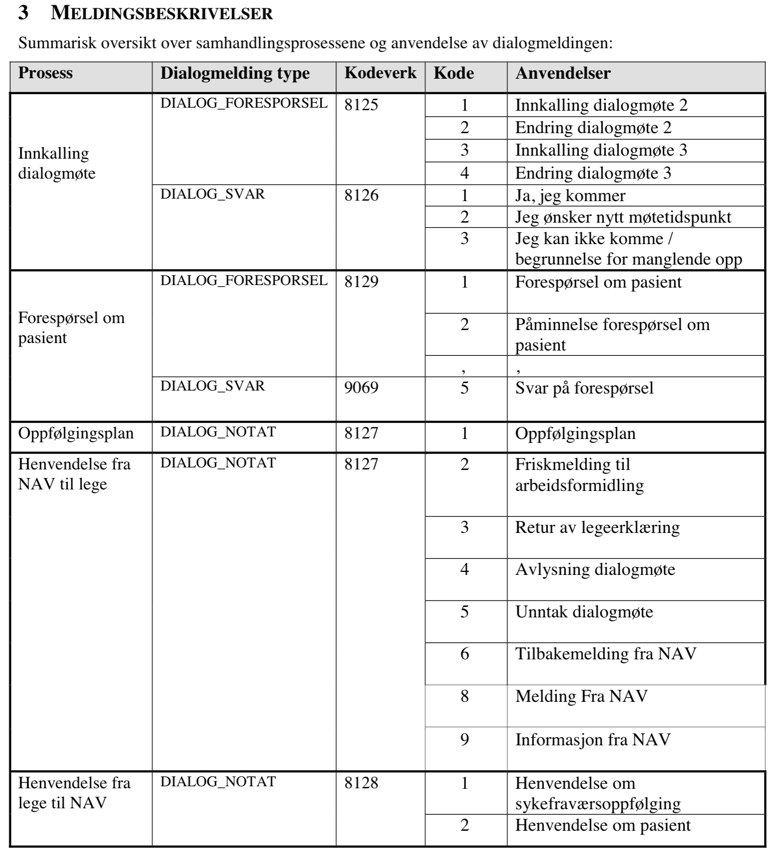

## Kafka Topic

### Beskrivelse
Topic inneholder bestilling av dialogmeldinger til fastleger og andre behandlere.

### Topic navn
teamsykefravr.isdialogmelding-behandler-dialogmelding-bestilling

### Properties

Beskrivelse av feltene i en record ([DialogmeldingToBehandlerBestillingDTO](../../src/main/kotlin/no/nav/syfo/dialogmelding/bestilling/kafka/DialogmeldingToBehandlerBestillingDTO.kt))

* `behandlerRef: String` Referanse til en bestemt behandler, definert i vårt system
* `personIdent: String` Personident til den sykmeldte
* `dialogmeldingUuid: String` UUID til dialogmeldingen
* `dialogmeldingRefParent: String or Null` Referanse til en annen dialogmelding, dersom denne dialogmeldingen er en oppfølging av en annen dialogmelding
* `dialogmeldingRefConversation: String` Referanse til en samtale. Brukes til å koble sammen melding inn og ut i samme samtaletråd
* `dialogmeldingType: String` Type dialogmelding: `DIALOG_FORESPORSEL`, `DIALOG_SVAR` og `DIALOG_NOTAT`. Når det sendes en `DIALOG_FORESPORSEL`, kreves det et `DIALOG_SVAR` tilbake. `DIALOG_NOTAT` er en melding som ikke krever svar, feks noe som kun er til informasjon.  
* `dialogmeldingKodeverk: String` Kodeverk for dialogmelding
* `dialogmeldingKode: Int` Kode som definerer hva slags dialogmelding dette er, i henhold til kodeverket. Ofte et tall mellom 1-9. Se [Dialogmeldingskoder](#dialogmeldingskoder).
* `dialogmeldingTekst: String or Null` Innholdet i dialogmeldingen. Kan være en stringserialisering av et dokument på et strukturert format.
* `dialogmeldingVedlegg: ByteArray or Null` Vedlegg til dialogmeldingen, en PDF på byte-array format.

### Dialogmeldingskoder
Under finnes et utklipp fra dokumentasjonen av kontrakt mellom NAV (emottak) og Norsk Helsenett for sending av dialogmeldinger.
Kolonnenavnene samsvarer med hhv `dialogmeldingType`, `dialogmeldingKodeverk` og `dialogmeldingKode` fra `DialogmeldingToBehandlerBestillingDTO`.

